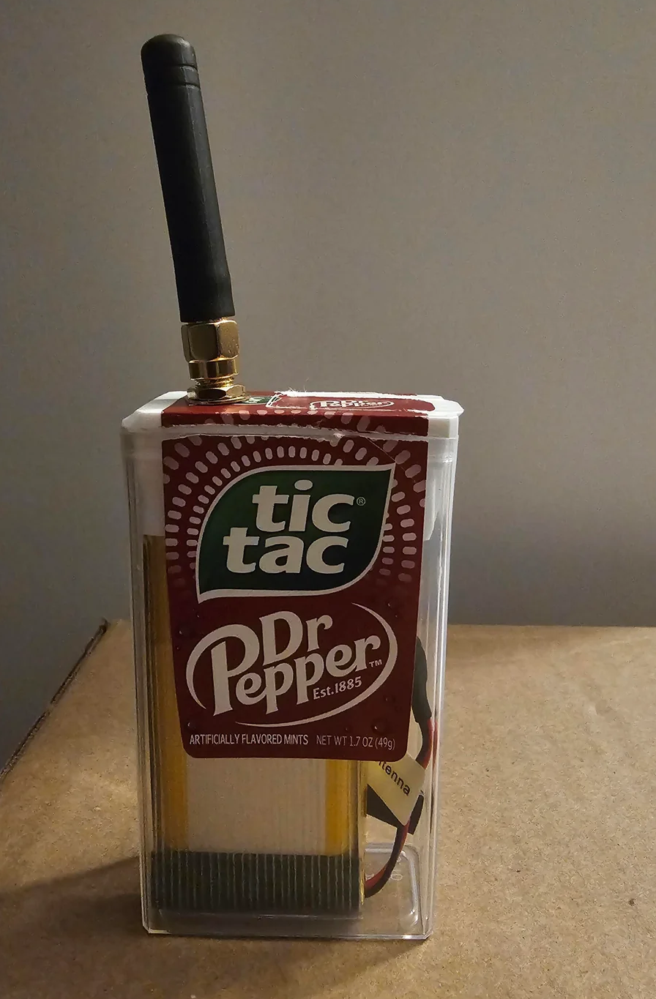

 

## Meshtastic VS Reticulum

| Meshtastic | Reticulum |
|---|---|
|LoRa only|**WiFi, Bluetooth, LoRa, etc**|
|limited to radio range|**connect across different networks**|
|**all platforms**|no iOS|
|**download apps**|run terminal commands and sideload apps|
|limited mesh|**more flexible mesh**|
|no audio, no images|**send files**|
|**lower barrier to entry, ease to onboard**|bigger learning curve|
|**wider adoption**|small but quickly growing community|
|potentially more public|**stronger encryption**|

## Meshtastic

[hardware flasher for meshtastic](https://flasher.meshtastic.org/)

[configuring meshtastic](https://meshtastic.org/docs/configuration/)

[customizing radio settings](https://meshtastic.org/docs/overview/radio-settings/)

[building your first LoRa network from scratch](https://media.ccc.de/v/38c3-building-your-first-lora-mesh-network-from-scratch#t=1437) VIDEO, talk at 38C3

[hacker's guide to meshtastic](https://media.ccc.de/v/38c3-hacker-s-guide-to-meshtastic-off-grid-encrypted-lora-meshnets-for-cheap#t=1718) VIDEO, talk at 38C3

[3D Case for printing](https://www.thingiverse.com/thing:6888371)

## Reticulum

[Why reticulum](https://pad.puscii.nl/p/reticulum_introduction)

[Reticulum manual](https://reticulum.network/manual/interfaces.html)

[Reticulum curriculum quickstart](https://github.com/pickles976/ReticulumCurriculum/tree/main/Reticulum)

[video quick start](https://www.youtube.com/watch?v=D2sfkqeyQyg)

[Hardware flasher](https://liamcottle.github.io/rnode-flasher/)

[nomadnet](https://github.com/markqvist/nomadnet) terminal text-based messaging and hosted pages

[writing pages in micron, for nomadnet](https://rfnexus.github.io/micron-parser-js/)

[MeshChatX](https://meshchatx.com/) reticulum GUI messaging client for macos, windows, linux

[columba](https://columba.network/) reticulum GUI messaging client for android

[rmap.world](https://rmap.world/) map of public reticulum nodes

[popular rnode settings](https://lavaforge.org/Reticulum-Things/Reticulum/wiki/Popular-RNode-Settings), caution, changing your radio settings will make you invisible to others whose settings don't match yours

